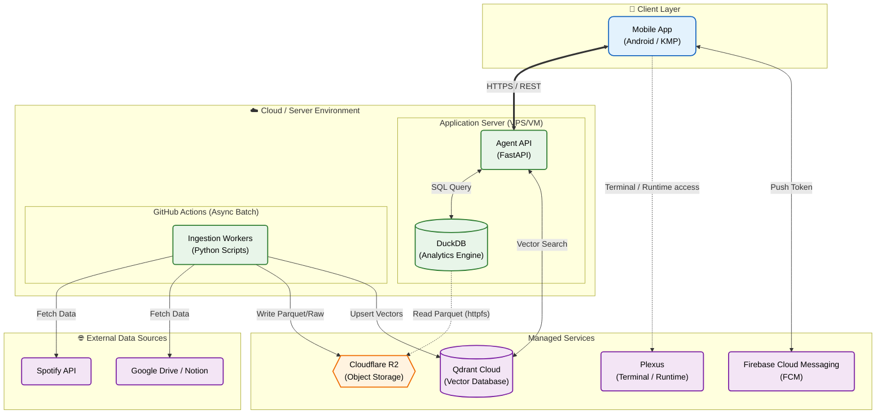

# システムアーキテクチャ

## Overview

EgoGraph は、個人ライフログを収集・保存・分析するためのデータ基盤と Agent API を中心に構成する。
terminal/runtime 系の実行基盤は 2026-03 時点で **Plexus** 側へ移管済みであり、このリポジトリでは保持しない。

## コンポーネント

### Ingestion

- GitHub Actions 上で定期実行される ETL/ELT パイプライン
- 外部 API から取得したデータを Raw JSON / Parquet として R2 に保存する

### Backend

- FastAPI ベースの Agent API
- DuckDB と Qdrant を組み合わせて分析・検索・応答生成を行う

### Frontend

- Kotlin Multiplatform + Compose Multiplatform の Android アプリ
- この repo には terminal 関連 UI 実装が残っているが、対応する runtime の所有権は Plexus 側にある

### Plexus

- tmux terminal access、push/webhook、将来の worker orchestration を担う runtime repository
- EgoGraph からは別リポジトリ境界として扱う

## 責務境界

- EgoGraph:
  - 個人データの収集、保存、分析
  - Agent API とライフログ活用
  - モバイルアプリ本体
- Plexus:
  - terminal/runtime 実装
  - tmux セッション接続
  - runtime 系の push / webhook / orchestration

## Notes

- Last.fm 連携は一時停止中。
- terminal/runtime 機能の実装修正は EgoGraph ではなく Plexus 側で管理する。
