# System Architecture Overview

## Architecture Diagram

```mermaid
flowchart TB
    %% Styles
    classDef client fill:#e3f2fd,stroke:#1565c0,stroke-width:2px,color:black,rx:10,ry:10;
    classDef server fill:#e8f5e9,stroke:#2e7d32,stroke-width:2px,color:black,rx:5,ry:5;
    classDef storage fill:#fff3e0,stroke:#ef6c00,stroke-width:2px,color:black,shape:cyl;
    classDef external fill:#f3e5f5,stroke:#7b1fa2,stroke-width:2px,color:black,rx:5,ry:5;
    classDef process fill:#fff,stroke:#666,stroke-width:1px,stroke-dasharray: 5 5,color:#666;

    subgraph ClientLayer ["📱 Client Layer"]
        direction TB
        MobileApp["Mobile / Web App\n(Capacitor)"]:::client
    end

    subgraph CloudEnv ["☁️ Cloud / Server Environment"]
        direction TB
        
        subgraph AppLayer ["Application Server (VPS/VM)"]
            direction TB
            AgentAPI["Agent API\n(FastAPI)"]:::server
            DuckDB[("DuckDB\n(Analytics Engine)")]:::server
        end

        subgraph IngestionLayer ["GitHub Actions (Async Batch)"]
            direction TB
            GHA["Ingestion Workers\n(Python Scripts)"]:::server
        end
    end

    subgraph ManagedServices ["Managed Services"]
        direction TB
        Qdrant[("Qdrant Cloud\n(Vector Database)")]:::external
        R2{{"Cloudflare R2\n(Object Storage)"}}:::storage
    end

    subgraph DataSources ["🌐 External Data Sources"]
        Spotify["Spotify API"]:::external
        LastFm["Last.fm API"]:::external
        Docs["Google Drive / Notion"]:::external
    end

    %% Connectivity
    MobileApp <==>|"HTTPS / REST"| AgentAPI
    
    AgentAPI <-->|"SQL Query"| DuckDB
    AgentAPI <-->|"Vector Search"| Qdrant
    
    DuckDB -.->|"Read Parquet (httpfs)"| R2
    
    GHA -->|"Fetch Data"| Spotify
    GHA -->|"Fetch Data"| LastFm
    GHA -->|"Fetch Data"| Docs
    GHA -->|"Write Parquet/Raw"| R2
    GHA -->|"Upsert Vectors"| Qdrant
    
    %% Layout Positioning
    MobileApp ~~~ AgentAPI
    AgentAPI ~~~ Qdrant
    GHA ~~~ R2
```




## Image Generation Prompt

The architecture image was generated using the following prompt:

```text
A professional system architecture diagram with a clean, modern style using simple badge-like icons.
The diagram should have a white background and clearly distinct sections.

Top Section: "Client Layer"
- Icon: Smartphone/Tablet
- Label: "Mobile/Web App (Capacitor)"

Middle Section: "Server Environment"
- Left Box: "Application Server"
  - Icon: API/Server Gear
  - Label: "Agent API (FastAPI)"
  - Icon: Database (connected to API)
  - Label: "DuckDB (Analytics)"
- Right Box (Separated): "Ingestion (Async)"
  - Icon: Gears/Worker
  - Label: "GitHub Actions"

Bottom Section: "Managed Services & Storage"
- Icon: Cloud Database
- Label: "Qdrant Cloud (Vector DB)"
- Icon: Storage Bucket
- Label: "Cloudflare R2 (Object Storage)"

Data Sources (Feeding into Ingestion):
- Icons: Music Note (Spotify), Documents (Docs)

Connections (Arrows):
1. Mobile App <-> Agent API (HTTPS)
2. Agent API <-> DuckDB (SQL)
3. Agent API <-> Qdrant (Search)
4. DuckDB -> Cloudflare R2 (Read Parquet)  <-- IMPORTANT: Database reads from Storage
5. GitHub Actions -> Spotify/Docs (Fetch)
6. GitHub Actions -> Cloudflare R2 (Write Parquet)
7. GitHub Actions -> Qdrant (Upsert)

IMPORTANT: NO connection between Mobile App and GitHub Actions.
Style: Flat design, pastel colors (Blue for client, Green for server, Orange for storage, Purple for external), rounded corners. High quality, technical presentation.
```
