# システムアーキテクチャ

## 1. 全体構成図

### 1.1 Architecture Overview


軽量サーバー（e2-micro等）での稼働を前提とし、メモリ負荷の高いベクトル検索を **Qdrant Cloud** にオフロードする構成。
データの取り込み（Ingestion）は **GitHub Actions** で定期実行し、サーバー負荷を最小化する。

```mermaid
flowchart TB
    %% Styles
    classDef client fill:#e3f2fd,stroke:#1565c0,stroke-width:2px,color:black,rx:10,ry:10;
    classDef server fill:#e8f5e9,stroke:#2e7d32,stroke-width:2px,color:black,rx:5,ry:5;
    classDef storage fill:#fff3e0,stroke:#ef6c00,stroke-width:2px,color:black,shape:cyl;
    classDef external fill:#f3e5f5,stroke:#7b1fa2,stroke-width:2px,color:black,rx:5,ry:5;
    classDef process fill:#fff,stroke:#666,stroke-width:1px,stroke-dasharray: 5 5,color:#666;

    subgraph ClientLayer ["📱 Client Layer"]
        direction TB
        MobileApp["Mobile App\n(Android / KMP)"]:::client
    end

    subgraph CloudEnv ["☁️ Cloud / Server Environment"]
        direction TB

        subgraph AppLayer ["Application Server (VPS/VM)"]
            direction TB
            AgentAPI["Agent API\n(FastAPI)"]:::server
            DuckDB[("DuckDB\n(Analytics Engine)")]:::server
        end

        subgraph IngestionLayer ["GitHub Actions (Async Batch)"]
            direction TB
            GHA["Ingestion Workers\n(Python Scripts)"]:::server
        end
    end

    subgraph ManagedServices ["Managed Services"]
        direction TB
        Qdrant[("Qdrant Cloud\n(Vector Database)")]:::external
        R2{{"Cloudflare R2\n(Object Storage)"}}:::storage
    end

    subgraph DataSources ["🌐 External Data Sources"]
        Spotify["Spotify API"]:::external
        Docs["Google Drive / Notion"]:::external
    end

    %% Connectivity
    MobileApp <==>|"HTTPS / REST"| AgentAPI

    AgentAPI <-->|"SQL Query"| DuckDB
    AgentAPI <-->|"Vector Search"| Qdrant

    DuckDB -.->|"Read Parquet (httpfs)"| R2

    GHA -->|"Fetch Data"| Spotify
    GHA -->|"Fetch Data"| Docs
    GHA -->|"Write Parquet/Raw"| R2
    GHA -->|"Upsert Vectors"| Qdrant

    %% Layout Positioning
    MobileApp ~~~ AgentAPI
    AgentAPI ~~~ Qdrant
    GHA ~~~ R2
```



> **Note**: Last.fm 連携は一時停止中。

### 1.2 Detailed Flow

```mermaid
flowchart TB
    subgraph "Client"
        Mobile[Mobile/Web App]
    end

    subgraph "Ingestion (GitHub Actions)"
        Action[Scheduled Workflows]
    end

    subgraph "External Server (VPS/GCP)"
        Agent[Agent API （FastAPI）]
        DuckDB[(DuckDB Engine)]
    end

    subgraph "Storage"
        R2{Object Storage\n（Cloudflare R2）}
    end

    subgraph "Managed Services"
        Qdrant[Qdrant Cloud\n（Vector DB）]
    end

    subgraph "Data Sources"
        Spotify
        Docs[Documents]
    end

    Mobile <-->|HTTPS| Agent

    Agent <-->|SQL Analytics| DuckDB
    Agent <-->|Vector Search| Qdrant

    DuckDB <-->|Read Only| R2

    Spotify --> Action
    Docs --> Action

    Action -->|Write Parquet/Raw| R2
    Action -->|Upsert Vectors| Qdrant
```



---

## 2. コンポーネント詳細

### 2.1 Ingestion Layer (GitHub Actions)

- **Role**: 定期的なデータ収集と加工。
- **Workflow**:
  - **Extract**: Spotify APIやドライブからデータを取得。
  - **Transform**: 構造化データ（Parquet）やベクトル（Embedding）に変換。
  - **Load**:
    - **Cloudflare R2**: 「正本」としてParquet/Rawファイルを保存。
    - **Qdrant**: 検索用ベクトルインデックスを更新。

### 2.2 Storage Layer

- **Object Storage (Cloudflare R2)**:
  - **正本 (Original)**。すべての事実データとドキュメントの実体を保持。
  - DuckDBから `httpfs` またはローカルマウント経由で参照される。
- **Semantic Data (Qdrant)**:
  - 意味検索用のインデックスのみを保持。

### 2.3 Analysis Layer (Dual Engine)

- **DuckDB**: **「事実」の集計 & 台帳管理**。
  - 例: 「去年、何回再生した？」「あのドキュメントどこ？」
  - Agentプロセスに内包されるライブラリとして動作。
- **Qdrant**: **「意味」の検索**。
  - 例: 「悲しい時に聴いた曲は？」
  - 高速なベクトル検索を提供。

### 2.4 Application Layer (Agent)

ユーザーの問いかけに対し、ツールを使い分けて回答を作る。

- **LangChain / LlamaIndex**: SQL生成とツール実行の制御。
- **Tool definitions**:
  - `query_analytics(sql)`: 数値的な集計や台帳参照。
  - `search_vectors(query_text)`: 意味的なインデックス検索。

### 2.5 Client Layer (Frontend)

ユーザーとのインターフェース。

- **Framework**: Kotlin Multiplatform + Compose Multiplatform
- **Role**: Native Android App, Chat UI.

---

## 3. データフロー (Search & Retrieval)

### 3.1 書き込み (Ingestion by GitHub Actions)

1.  **Fetch**: ActionsがAPI等からRawデータ（JSON）を取得。
2.  **Transform**: 共通スキーマ（Unified Schema）に変換。
3.  **Save**:
    - **Cloudflare R2 (正本)**: 生ログ、ドキュメント本文、Parquetファイルを保存。
    - **Qdrant (索引)**: IDとベクトル、フィルタ用タグを登録。

> **Note**: サーバー側のDuckDBは、R2上の更新されたファイルを読み取る（メタデータ更新はサーバー起動時や定期タスクで行う、あるいはActionsからトリガーする）。

### 3.2 読み取り (Search Pattern)

#### A. ドキュメントRAG (doc_chunks)

1.  **Embed**: ユーザーの質問をベクトル化。
2.  **Index Search**: Qdrant (`doc_chunks_v1`) から候補の `chunk_id` を取得。
3.  **Ledger Lookup**: DuckDB (`mart.documents`) で `chunk_id` を照会し、実データの場所 (`s3_uri`) を特定。
4.  **Fetch Original**: R2 (またはキャッシュ済みParquet) から本文を取得。
5.  **Generate**: LLMに渡して回答生成。

#### B. Spotify "思い出し" RAG (daily_summaries)

「台帳」自体が分析可能なデータを持つケース（DuckDBがデータをマウントしている場合）。

1.  **Embed**: 質問をベクトル化。
2.  **Index Search**: Qdrant (`spotify_daily_summaries_v1`) から `summary_id` を取得。
3.  **Retrieve**: DuckDB (`mart.daily_summaries`) からサマリー本文と、関連する統計データを取得（DuckDBがR2上のParquetを透過的に扱う）。
4.  **Generate**: 回答生成。

---

## 4. スケーラビリティと制限

### 4.1 データ量

- **DuckDB**: 数億行〜TB級のParquetファイルでも、単一ノードで十分に高速処理可能。
- **メモリ**: Aggregationなどの重い処理も、DuckDBの "Out-of-core" 処理により、メモリ容量を超えてもディスク（Temp領域）を使って実行できる。

### 4.2 同時実行性

- **Read**: 複数のAgentプロセス（Worker）からの同時読み取りは可能（Parquetファイルベースであれば）。
- **Write**: GitHub Actionsによるバッチ書き込みが主のため、サーバー側のロック競合は最小限。

---

## 5. セキュリティ

- **認証**: 実装しない（ローカル/個人利用前提）。
- **データ保護**: 必要であれば、Parquetファイルの暗号化や、ファイルシステムレベルでのアクセス権限設定を行う。

---

## Appendix: Architecture Image Generation Prompt

以下のプロンプトを使用してアーキテクチャ図を生成しました：

```text
A professional system architecture diagram with a clean, modern style using simple badge-like icons.
The diagram should have a white background and clearly distinct sections.

Top Section: "Client Layer"
- Icon: Smartphone/Tablet
- Label: "Mobile/Web App (Capacitor)"

Middle Section: "Server Environment"
- Left Box: "Application Server"
  - Icon: API/Server Gear
  - Label: "Agent API (FastAPI)"
  - Icon: Database (connected to API)
  - Label: "DuckDB (Analytics)"
- Right Box (Separated): "Ingestion (Async)"
  - Icon: Gears/Worker
  - Label: "GitHub Actions"

Bottom Section: "Managed Services & Storage"
- Icon: Cloud Database
- Label: "Qdrant Cloud (Vector DB)"
- Icon: Storage Bucket
- Label: "Cloudflare R2 (Object Storage)"

Data Sources (Feeding into Ingestion):
- Icons: Music Note (Spotify), Documents (Docs)

Connections (Arrows):
1. Mobile App <-> Agent API (HTTPS)
2. Agent API <-> DuckDB (SQL)
3. Agent API <-> Qdrant (Search)
4. DuckDB -> Cloudflare R2 (Read Parquet)  <-- IMPORTANT: Database reads from Storage
5. GitHub Actions -> Spotify/Docs (Fetch)
6. GitHub Actions -> Cloudflare R2 (Write Parquet)
7. GitHub Actions -> Qdrant (Upsert)

IMPORTANT: NO connection between Mobile App and GitHub Actions.
Style: Flat design, pastel colors (Blue for client, Green for server, Orange for storage, Purple for external), rounded corners. High quality, technical presentation.
```
