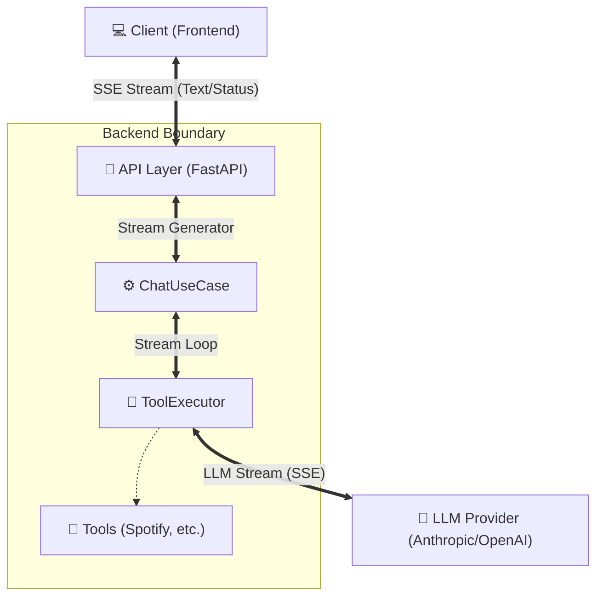
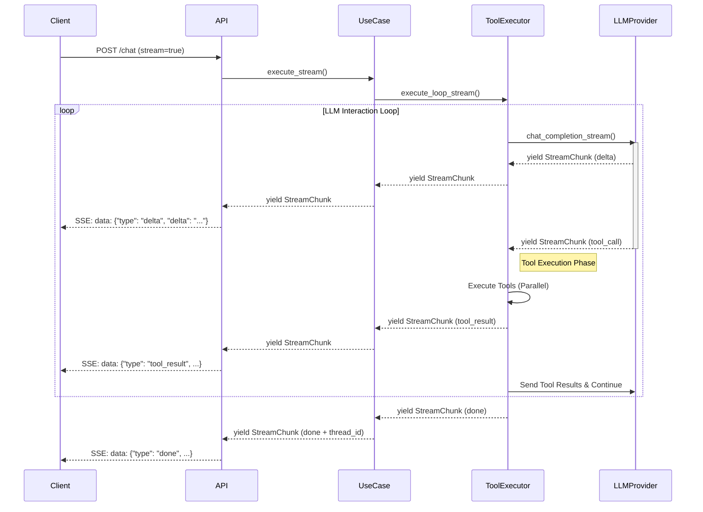

# LLM ストリーミングアーキテクチャ

EgoGraphのチャット機能は、リアルタイムな応答表示とツール実行の進捗表示を実現するため、Server-Sent Events (SSE) ベースのストリーミングアーキテクチャを採用しています。

## 1. アーキテクチャ概要

ストリーミングは以下の5つのレイヤーを通過し、LLMの生成したトークンをリアルタイムにフロントエンドへ届けます。

### コンポーネント構成図



### レイヤーの役割

| レイヤー     | コンポーネント     | 役割                                                              |
| ------------ | ------------------ | ----------------------------------------------------------------- |
| **Frontend** | React / API Client | SSE受信、バッファリング、画面描画                                 |
| **API**      | `api/chat.py`      | HTTP接続の維持、SSE形式でのレスポンス配信 (`StreamingResponse`)   |
| **UseCase**  | `ChatUseCase`      | スレッド管理、履歴管理、ストリーミング全体の統括                  |
| **Domain**   | `ToolExecutor`     | ツール実行ループの制御 (Thought -> Tool Call -> Result -> Answer) |
| **Infra**    | `LLMProvider`      | プロバイダー固有APIの差異吸収、統一 `StreamChunk` への変換        |

---

## 2. データフロー詳細

### ストリーミングシーケンス

ユーザーがメッセージを送信してから、最終的な回答が返るまでのフローです。



---

## 3. コンポーネント詳細

### 3.1 UseCase Layer (`ChatUseCase`)

`ChatUseCase.execute_stream()` はストリーミングの司令塔です。

- **スレッド管理**: 会話履歴の読み込み・保存
- **ループ起動**: `ToolExecutor` を呼び出し、LLMとの往復（Re-Actループ）を開始

### 3.2 Executor Layer (`ToolExecutor`)

**責務**: "Thinking" (LLM) と "Acting" (Tool) のサイクルを回します。

- **テキスト配信**: LLMからのテキストは即座に上流へ流す（ユーザー待機時間の短縮）
- **ツール実行**: `tool_call` チャンクを受け取るとバッファリングし、全引数が揃った時点で並列実行
- **使用量管理**: メタデータ（Token Usage）を保持し、最終的な `done` チャンクに付与

### 3.3 Infrastructure Layer (`LLMProvider`)

**責務**: プロバイダーごとの差異を吸収し、統一フォーマット `StreamChunk` に正規化します。

#### Providerごとの実装差異

| Provider      | ストリーミング特性                  | 実装対応                                                                 |
| ------------- | ----------------------------------- | ------------------------------------------------------------------------ |
| **Anthropic** | イベントが細分化 (start/delta/stop) | 内部バッファでJSON断片を結合し、`stop` イベントで `tool_call` を発行     |
| **OpenAI**    | 引数が断片化して届く                | JSONパースを試行しながらバッファリング。不完全な場合は次のチャンクを待つ |

---

## 4. API インターフェース (StreamChunk)

フロントエンドには以下の `StreamChunk` 型が SSE で配信されます。

| Type          | 内容             | フロントエンドの挙動              |
| ------------- | ---------------- | --------------------------------- |
| `delta`       | テキスト断片     | 画面に追記表示 (打鍵感の演出)     |
| `tool_call`   | ツール名、引数ID | 「検索中...」などのステータス表示 |
| `tool_result` | 実行結果         | (デバッグ用) 結果の確認           |
| `error`       | エラー内容       | エラーメッセージのトースト表示    |
| `done`        | Usage, ThreadID  | ローディング終了、スレッドID保存  |

### JSONペイロード例

```json
// delta
{"type": "delta", "delta": "こんにちは"}

// tool_call
{"type": "tool_call", "tool_calls": [{"name": "search", "id": "call_123", "parameters": {...}}]}

// done
{"type": "done", "finish_reason": "stop", "usage": {"total_tokens": 150}, "thread_id": "th_abc"}
```

---

## 5. エラーハンドリングと安全性

### ストリームの中断対応

- **OpenAI**: ネットワーク切断等で `[DONE]` が来ない場合、バッファに残ったツールコールを強制フラッシュしてデータ損失を防ぐ (PR #25で対応)
- **Anthropic**: JSONパースエラー時に `error` チャンクを発行し、クライアント側で検知可能にする

### タイムアウト制御

無限ループや長時間実行を防ぐため、以下のガードレールを設けています。

1. **Max Iterations**: ツール実行ループの最大回数（デフォルト5回）
2. **Total Timeout**: リクエスト全体の処理時間制限

---

## 6. 実装ファイル構造

重要なファイルのマッピングです。

- **Api Layer**: [backend/api/chat.py](file:///root/workspace/ego-graph/wt1/backend/api/chat.py)
- **UseCase**: [backend/usecases/chat/chat_usecase.py](file:///root/workspace/ego-graph/wt1/backend/usecases/chat/chat_usecase.py)
- **Executor**: [backend/usecases/chat/tool_executor.py](file:///root/workspace/ego-graph/wt1/backend/usecases/chat/tool_executor.py)
- **Providers**:
  - [anthropic.py](file:///root/workspace/ego-graph/wt1/backend/infrastructure/llm/providers/anthropic.py)
  - [openai.py](file:///root/workspace/ego-graph/wt1/backend/infrastructure/llm/providers/openai.py)
